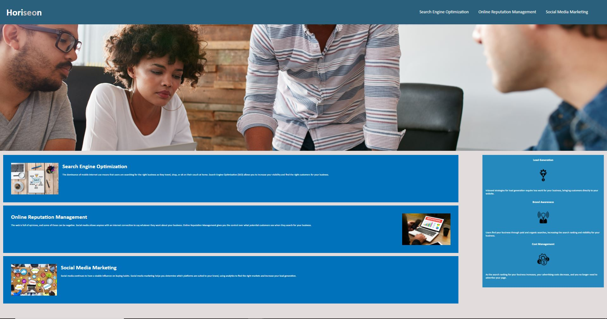

# Horiseon

A website for SEO Company Horiseon.

## Purpose of this website

This was my very first website that I've created using HTML and CSS. Most of the CSS codes were already in the file to help me out. All we had to do was to create an HTML from scratch to make it look exactly like the screenshot image that was provided, which should be about 95% similar to what I produced. The 5% was because I couldn't get the exact width and height to match the image provided. After completing the page, the links should be clickable and should also bring us down to where the topic is being mentioned on the page.

## Screenshot

## Links

https://fongvang09.github.io/horiseon/

